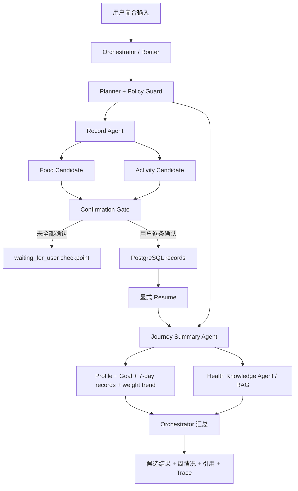

# Journey Multi-Agent 数据流

> 版本：Demo Seal v1（2026-08-10）
> 决策依据：ADR-038。本文描述已实现代码，不展示或保存模型隐藏思维过程。

## 1. 架构边界

Journey 使用一个 Orchestrator 和三个职责受限的 Specialist Agent，全部运行在同一个 FastAPI
模块化单体与同一 Docker API 容器中。它不是 Agent 群聊，也没有十几个自治角色。

| 角色 | 职责 | 允许的主要工具 | 禁止事项 |
|---|---|---|---|
| Orchestrator | 意图路由、拆分、计划、共享 Run State、汇总与确认判断 | Router、Planner、Policy | 不直接写健康记录 |
| Record Agent | 把 food/activity/weight 自然语言转为结构化候选 | `*.parse_candidate` | 不直接写数据库 |
| Health Knowledge Agent | 受控健康知识检索、引用和安全拒答 | `knowledge.retrieve`、`knowledge.safe_summary` | 不自由上网，不诊断疾病 |
| Journey Summary Agent | 读取画像、目标、7/30 天记录和体重趋势并总结 | `context.load`、`journey.read`、`weekly_summary.generate` | 不修改业务事实 |

角色和工具的 allowlist 位于 `backend/app/agent/specialists.py`；Policy 会拒绝 Specialist 与工具
不匹配的计划。Planner 即使输出任意函数名也无法越过服务端类型化工具注册表。

## 2. 主演示数据流

输入：`今天中午吃了一份牛肉面，晚上跑了5公里，我这周减脂情况怎么样？`

真正写库只发生在 `/api/v1/agent/confirmations/{candidate_id}`。Run、Planner、Specialist 或
Resume 都不能绕过 Confirmation Gate。两个候选全部确认后，Resume 才重新读取最新数据生成
周总结。

## 3. Run State 与可观察性

公开 Trace 只保存结构化执行事实：

- Router：`intent`、`selected_agents`、`duration_ms`；
- Specialist Step：`specialist`、`tool`、`status`、`duration_ms`；
- Record Agent：`candidate_count`；
- Knowledge Agent：查询、检索文档、最高分、引用；
- Summary Agent：`data_range_days`、结果状态；
- Confirmation：`pending/confirmed/rejected` 与进度；
- Run：Provider、Model、Prompt/Schema/Knowledge 版本、Token、重试、成本和总延迟。

原始消息只保存 hash 与长度；Trace 不保存 Authorization、Key、完整 Prompt、模型隐藏推理或
Chain-of-Thought。前端复用首页现有 Plan / Step / Observation 区域展示协作链路。

## 4. 失败与回退

- 外部模型超时最多有限重试，当前 Demo 默认 30 秒、最多 1 次；
- Knowledge 无足够 Context 时返回 `insufficient_context`，不调用模型编造答案；
- 知识生成失败可走 `knowledge.safe_summary`；建议生成失败可走
  `recommendation.rules_fallback`；
- 不跨 Provider 暗中转发健康数据，不无限循环；最多 6 步、2 次重规划；
- Mock 是 CI、单元/集成测试和离线开发 Provider，不能冒充真实模型质量。

## 5. 当前验证

- Docker Mock 网络黑盒：2/2；
- 真实 DeepSeek 主演示复合输入：1/1，28.02 秒；
- 前端 Playwright：复合 Multi-Agent + 图片确认两条 E2E，2/2；
- 100 条后端/评测测试与 46 条移动 Jest + 5 条逻辑测试通过。

真实 Provider 仍受外部网络、限流和延迟影响；可解释降级是产品能力，不等于生产 SLA。
