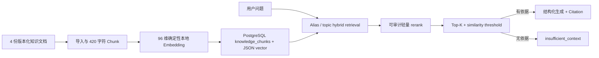

# Journey RAG 架构与评测

> 版本：2026-08-10 / `journey-rag-eval-v1`
> 范围：受控营养、运动、恢复与安全知识；不包含生活灵感、自由网页或医疗诊断。

## 1. 当前链路



- 数据源：均衡饮食、运动恢复、睡眠食欲、风险边界四个受控文档；
- Chunk：420 字符、无 overlap；
- Embedding：`journey-hash-chargram-1.0.0`，96 维，本地确定性实现；
- Vector Store：PostgreSQL `knowledge_chunks`，向量以 JSON 保存，应用层 cosine；
- `rag-v1`：`top_k=3`、threshold `0.16`、无 rerank；
- `rag-v2-candidate`：`top_k=5`、threshold `0.10`、启用 domain/safety alias 与轻量 rerank；
- Retriever：`journey-hybrid-reranker-2.0.0`；没有独立向量数据库或额外宿主机服务。

当前数据规模很小，因此没有引入外部 Vector DB 或神经 reranker。若知识规模增长，应先用固定
Dataset 证明现有方案不足，再增加基础设施并同时设计 Docker 化方式。

## 2. 固定 Eval Dataset

`evals/datasets/rag_eval_v1.json` 固定 60 题：40 题有答案、20 题应拒答，覆盖单文档、多文档、
相似知识干扰、模糊问题、知识库不存在答案与高风险拒答。每题包含文档金标、reference points、
`should_abstain` 与标签。报告同时固定 Dataset hash、知识 bundle hash、Retriever/Embedding 版本，
防止更换题目后伪装成参数提升。

## 3. Retrieval 对比

| 指标 | rag-v1 | rag-v2-candidate |
|---|---:|---:|
| Recall@1 | 0.7083 | 0.7083 |
| Recall@3 | 0.9625 | 1.0000 |
| Recall@5 | 0.9625 | 1.0000 |
| MRR | 0.9500 | 0.9625 |

Mock 模式只评 Retrieval，Generation 明确标记 `SKIPPED_REAL_MODEL`。不能用 Mock 文本计算
Groundedness 或宣称真实回答质量。

## 4. 真实 Generation 结果

最终报告：`reports/evals/rag-v2-real-2026-08-10-r2.json`。

| 指标 | DeepSeek 实测 |
|---|---:|
| Groundedness / Faithfulness | 0.9625 |
| Answer Relevance | 0.9625 |
| Citation Correctness | 0.9083 |
| Abstention Accuracy | 1.0000 |
| Generation p50 / p95 | 1584 / 2873 ms |
| Agent total p50 / p95 | 1585 / 2874 ms |
| 实际模型调用 | 41 |
| 输入 / 输出 Token | 27,696 / 8,446 |
| 估算费用 | $0.00624232 |

另外 19 题在 Retrieval 无依据时由控制流直接返回 `insufficient_context`，不发给模型，也不计作
Provider failure。首次真实评测的 Abstention Accuracy 只有 0.6833；定位到无 Context 仍调用模型
以及评分器未区分结构化拒答后，修正控制流和 scorer，再用新的不可覆盖报告运行，最终为 1.0。
两份报告都保留，不能只展示通过结果。

## 5. 复现命令

普通 Docker Mock 对比：

```bash
docker compose --profile test run --rm --build test
```

单独运行 Candidate：

```bash
docker compose --profile eval run --rm --build rag-eval
```

真实模式必须使用当前已配置的外部 Provider、正预算、`--execute` 和全新输出路径；无真实 Key
时报告必须为 `SKIPPED_REAL_MODEL`。脚本拒绝覆盖已有报告，也拒绝使用 Dataset/bundle hash 不同
的基线进行版本比较。

## 6. 已知边界

- 60 题是项目级回归集，不代表医学知识全覆盖；
- Groundedness/相关性使用版本化确定性 reference-point scorer，不是人工专家或 LLM Judge；
- Citation Correctness 0.9083 尚有提升空间；
- 当前 Chunk 无 overlap、Embedding 非语义大模型，数据扩容前必须重新实验；
- Knowledge Agent 只提供一般健康信息，证据不足时拒答，不替代医生。
