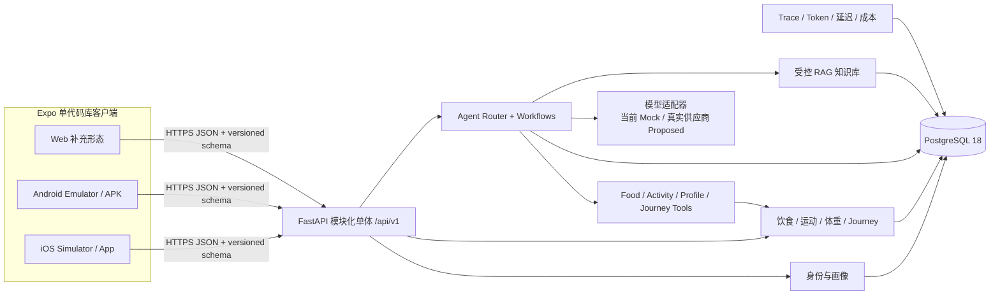
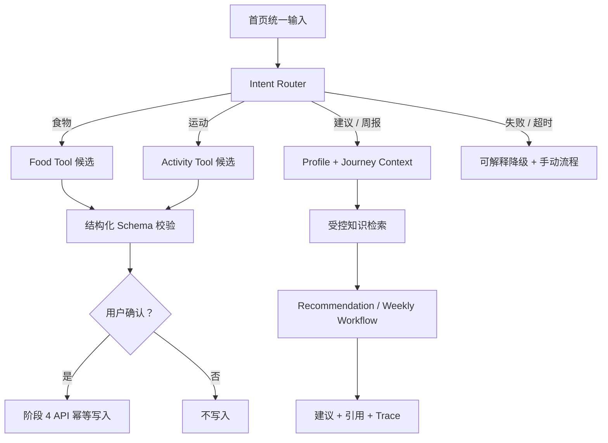
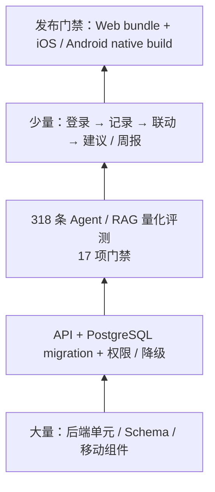

# Journey 架构与质量图

## 系统架构

```mermaid
flowchart LR
  subgraph Clients["Expo 单代码库客户端"]
    IOS["iOS Simulator / App"]
    AND["Android Emulator / APK"]
    WEB["Web 补充形态"]
  end
  API["FastAPI 模块化单体 /api/v1"]
  AUTH["身份与画像"]
  CORE["饮食 / 运动 / 体重 / Journey"]
  AGENT["Agent Router + Workflows"]
  TOOLS["Food / Activity / Profile / Journey Tools"]
  RAG["受控 RAG 知识库"]
  DB[("PostgreSQL 18")]
  OBS["Trace / Token / 延迟 / 成本"]
  MODEL["模型适配器\n当前 Mock / 真实供应商 Proposed"]

  IOS & AND & WEB -->|"HTTPS JSON + versioned schema"| API
  API --> AUTH & CORE & AGENT
  AUTH & CORE & AGENT & RAG & OBS --> DB
  AGENT --> TOOLS
  TOOLS --> CORE
  AGENT --> RAG
  AGENT --> MODEL
```

## Agent 确认式工作流

```mermaid
flowchart TD
  INPUT["首页统一输入"] --> ROUTE["Intent Router"]
  ROUTE -->|"食物"| FOOD["Food Tool 候选"]
  ROUTE -->|"运动"| ACT["Activity Tool 候选"]
  ROUTE -->|"建议 / 周报"| CTX["Profile + Journey Context"]
  CTX --> RET["受控知识检索"] --> WF["Recommendation / Weekly Workflow"]
  FOOD & ACT --> SCHEMA["结构化 Schema 校验"]
  SCHEMA --> CONFIRM{"用户确认？"}
  CONFIRM -->|"是"| WRITE["阶段 4 API 幂等写入"]
  CONFIRM -->|"否"| DISCARD["不写入"]
  WF --> OUTPUT["建议 + 引用 + Trace"]
  ROUTE -->|"失败 / 超时"| FALLBACK["可解释降级 + 手动流程"]
```

## 测试金字塔

```mermaid
flowchart BT
  UNIT["大量：后端单元 / Schema / 移动组件"]
  API["API + PostgreSQL migration + 权限 / 降级"]
  EVAL["318 条 Agent / RAG 量化评测\n17 项门禁"]
  E2E["少量：登录 → 记录 → 联动 → 建议 / 周报"]
  BUILD["发布门禁：Web bundle + iOS / Android native build"]
  UNIT --> API --> EVAL --> E2E --> BUILD
```

设计要点：单仓库共享契约；后端保持模块化单体；客户端不持有模型 Key；Agent 候选与核心
写入分离；版本化 Prompt/Schema/知识库和阈值报告使改进可量化、可回归、可解释。
