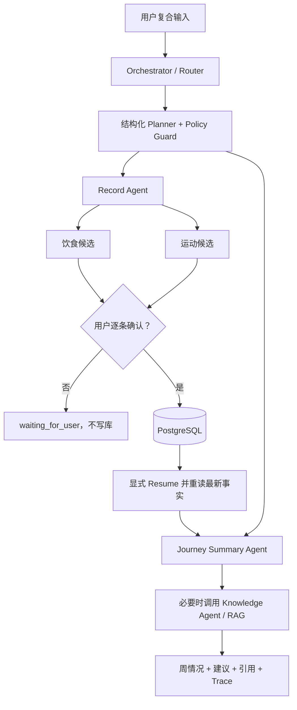
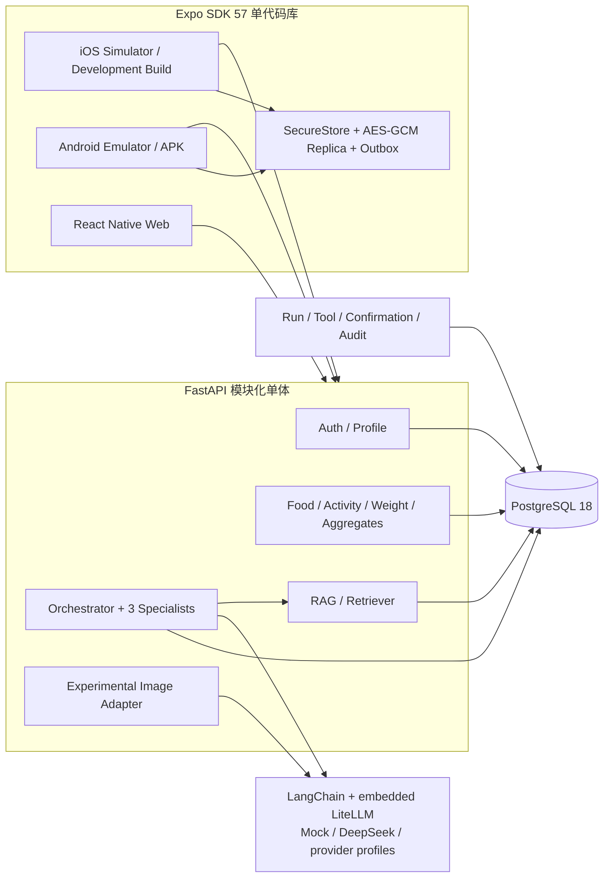
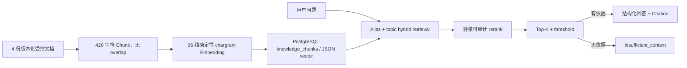

# Journey 秋招跨岗位项目素材知识库

> 快照日期：2026-08-13
> 适用岗位：Agent 开发、测试开发、运维/DevOps、售前/解决方案、产品经理、AI 产品经理；亦可供
> 后端、客户端和全栈岗位取材。
> 使用目的：作为“事实素材库”交给另一个 Codex，结合具体 JD 生成简历项目经历、自我介绍、
> STAR 案例和面试问答。本文不是新的 Roadmap，也不替代 ADR、执行日志或测试报告。
> 事实边界：只写当前仓库代码、报告和执行证据能够证明的内容；Mock、真实模型、实验性功能、
> 可部署配置和真正上线必须严格区分。

## 0. 给后续 Codex 的使用说明

### 0.1 使用流程

1. 先读取目标岗位 JD，提取职责、技术关键词、业务关键词和交付要求。
2. 从本文“岗位素材地图”选择最相关的 3—5 个素材编号，不要把所有技术堆进同一版简历。
3. 每条简历描述使用“问题/目标 + 动作 + 技术或方法 + 可验证结果”结构。
4. 量化数字只能从“已核验指标快照”或对应素材中选择，不得自行补全 DAU、准确率、节省比例、
   生产可用性、收入等仓库中不存在的数据。
5. 面试回答应主动说明陈述边界。失败实验、No-Go 和 Conditional 不是负面材料，它们体现质量
   意识、风险控制和产品判断。
6. 如果使用日期晚于本快照，应先到 Journey 仓库重新核验代码、`docs/EXECUTION_LOG.md` 和报告，
   不得假定本文指标仍是最新值。

### 0.2 状态标签

| 标签 | 含义 | 可以怎样写 | 不能怎样写 |
|---|---|---|---|
| `IMPLEMENTED` | 代码、契约或配置已经实现 | “实现”“设计并落地” | 不自动等于已上线 |
| `REAL-VALIDATED` | 已使用真实模型或真实运行环境产生证据 | “真实 DeepSeek 门禁通过” | 不外推为生产 SLA |
| `MOCK-VALIDATED` | 使用确定性 Mock 验证工程闭环 | “Mock 回归通过” | 不宣称真实语义质量 |
| `DEMO-READY` | 本机模拟器/容器可用于求职演示 | “完成本机 Demo 验收” | 不宣称公网生产或商店发布 |
| `EXPERIMENTAL/NO-GO` | 链路可运行，但质量门禁未通过 | “完成实验并据评测作出 No-Go” | 不写成正式可用能力 |
| `CONDITIONAL` | 配置或路径具备，仍有外部条件未验证 | “建立可部署基线” | 不写成已部署/已运营 |
| `FUTURE` | 已明确后置，不是当前实现 | 只可写“规划边界” | 不得列入项目功能成果 |

### 0.3 素材编号

- `OV-*`：项目概览与迁移；`PD-*`：产品设计；`AG-*`：Agent；`RAG-*`：检索与评测；
- `QA-*`：测试开发；`OPS-*`：Docker、CI 和交付；`SEC-*`：安全隐私；`CASE-*`：问题解决案例；
- `ROLE-*`：按岗位组织的可选素材。所有路径均相对 Journey 仓库根目录。

---

## 1. 项目事实卡

### 1.1 一句话定义

Journey 是一个从旧版微信健身小程序渐进迁移而来的跨平台 AI 健康记录 App。用户在首页用一句
自然语言记录饮食、运动或体重并询问阶段进展；受控 Multi-Agent 把输入拆成结构化候选和总结任务，
健康记录只有经过用户确认才写入 PostgreSQL，Knowledge Agent 在需要时通过受控 RAG 提供引用或
返回 `insufficient_context`。

### 1.2 当前交付状态

- `DEMO-READY`：iOS Simulator 是主演示端，Android Emulator 用于跨平台验收，Web 是备用形态。
- `IMPLEMENTED`：邮箱/用户名 + 密码身份体系、画像/目标、饮食/运动/体重 CRUD、Home 聚合、
  7/30 天 Journey、AI 总结、离线副本与同步冲突处理。
- `REAL-VALIDATED`：DeepSeek 文字 Agent、复合 Multi-Agent 场景、Agent v3 计划/恢复门禁、RAG
  generation 和 7 天总结均有真实调用证据。
- `EXPERIMENTAL/NO-GO`：食物图片“识别候选 → 用户校正 → 确认保存”链路存在，但独立密封集
  质量门禁失败，正式环境不应启用。
- `CONDITIONAL`：单服务器 production Compose、Web、Caddy HTTPS 和备份路径已建立，尚未租用
  公网服务器、绑定域名、获得正式证书或形成生产 SLA。
- 当前不是医疗产品，不提供疾病诊断或治疗建议。

### 1.3 已核验指标快照

| 维度 | 2026-08-13 快照 | 证据 |
|---|---:|---|
| OpenAPI | 25 个 Path、34 个 HTTP Operation | `packages/contracts/openapi.json` |
| 后端/评测自动化 | 100/100 通过 | `reports/backend/junit.xml` |
| 后端覆盖率 | 90.69%（3672/4049 lines） | `reports/backend/coverage.xml` |
| 版本化 Agent/契约样本 | 362 条，26 项阻断门禁 | `evals/datasets/`、`reports/evals/latest.json` |
| 独立 RAG Eval | 60 题：40 题有依据、20 题应拒答 | `evals/datasets/rag_eval_v1.json` |
| 移动端 | Jest 48/48、Node 逻辑 5/5 | `docs/EXECUTION_LOG.md` 最新记录 |
| 网络黑盒 | Mock Requests 2/2；真实复合场景 1/1 | `reports/backend/*blackbox*.xml` |
| Web E2E | Playwright 核心场景 2/2 | `apps/mobile/e2e/core-flow.spec.ts` |
| RAG v2 Retrieval | Recall@1 0.7083、Recall@3/5 1.0、MRR 0.9625、nDCG@5 0.97232 | `reports/evals/rag-v2-candidate.json` |
| RAG 真实 Generation | Groundedness 0.9625、Relevance 0.9625、Citation 0.9083、Abstention 1.0 | `reports/evals/rag-v2-real-2026-08-10-r2.json` |
| RAG 真实性能/成本 | p50/p95 1585/2874 ms；41 次模型调用；$0.00624232 | 同上 |
| Agent v3 真实门禁 | checkpoint 4/4、恢复选择 2/2、10 次调用、$0.00171864 | `evals/reports/REAL_AGENT_V3_PROVIDER_ACCEPTANCE.json` |
| 真实复合 Demo | 1/1，28.02 秒 | `docs/EXECUTION_LOG.md` 阶段 13 |
| 真实周总结修复复验 | HTTP 200，端到端 20.4 秒，3 条引用，无降级 | `docs/EXECUTION_LOG.md` 2026-08-13 |
| 图片识别密封门禁 | Top-3 37/55=67.27%，中式家庭餐 12/20=60%，Schema 59/60；FAIL | `evals/reports/STAGE9_QWEN_RECOGNITION_V2.json` |

说明：仓库中某些历史报告保留了当时的 69、85、93、46 等测试数字，它们是阶段快照，不应覆盖
上表最新口径。真实失败报告也被刻意保留，不能只引用最终通过报告。

---

## 2. 项目背景、目标与开发演进

### OV-01：为什么要迁移

旧项目是 Taro/React 微信小程序，已经形成首页、里程/Journey、我的、饮食与运动记录等产品语义，
但身份依赖微信 OpenID/UnionID，API 使用 `_mini` 命名，数据为 SQLite，前端依赖 Taro 页面生命周期
和微信组件，缺乏自动化测试、CI、正式 RAG 和跨平台发布能力。旧端实际还出现微信登录无法连接后端
的问题。

迁移没有推倒产品逻辑重来，而是保留温暖白色 + 薄荷绿的品牌气质、叶子卡通角色、记录/回看/画像
三类核心心智，退役微信专属运行时并重建跨平台身份、数据、Agent、测试和交付链路。

证据：`docs/CURRENT_PROJECT_AUDIT.md`、`docs/product/WECHAT_RETIREMENT_CHECKLIST.md`、
`docs/product/LEGACY_UI_REFERENCE.md`。

### OV-02：产品范围如何收敛

一级入口固定为：首页、Journey、我的。

- 首页：一个统一自然语言输入框，自动识别饮食、运动、体重、查询、知识和总结意图；同时保留手动
  记录入口与今日指标。
- Journey：保持“多日记录与趋势”语义，展示 7/30 天摄入、运动、体重、目标、按日明细和 AI
  总结，不改成单日聊天 Timeline。
- 我的：身份、画像、目标、设置与受限生活灵感入口。

语音、视频、微信/OAuth/手机验证码、HealthKit/Health Connect、Push、通用浏览器、自由网页搜索、
自动抓取小红书和复杂社交全部归入 `Post-Demo / Future`，避免 Demo 被外围能力稀释。

### OV-03：阶段演进与工程价值

| 阶段 | 主要交付 | 可用于面试的价值 |
|---|---|---|
| 1 | 决策、基线和路线图 | 用 ADR 和验收标准控制大改造风险 |
| 2 | 旧资产提取、截图、规则盘点、微信端退役 | 渐进迁移、资产复用、技术债治理 |
| 3 | Expo 骨架、FastAPI/PostgreSQL 最小 Compose、三端运行 | 跨平台与容器基线 |
| 4 | 身份、画像、核心模型、稳定 `/api/v1`、Alembic | 契约、数据库与鉴权工程 |
| 5 | 首页/Journey/我的、手动记录、双模拟器 | 产品主链路与前后端打通 |
| 6 | Agent、工具、结构化输出、RAG、确认写入 | 从 LLM API 到业务 Agent |
| 7 | Agent/RAG Eval、API/移动/E2E、CI | 量化质量门禁 |
| 8 | staging、三端构建、演示与发布文档 | 可交付性、演示与回退 |
| 9 | 食物图片实验与真实质量 No-Go | 数据集、密封评测和产品止损 |
| 10 | Planner → Policy → Executor → Verifier | 有界 Agent v2 闭环 |
| 11 | checkpoint、Resume、Observation、有限重规划、Requests + Allure | Human-in-the-loop 和黑盒验证 |
| 12 | 原生 local-first、副本加密、Outbox、冲突处理、受限生活灵感 | 弱网体验、隐私和同步一致性 |
| 13 | 有界 Multi-Agent、60 题 RAG Eval、复合 Demo、Docker preflight | 秋招 Demo 封板 |
| 封板维护 | 长任务超时/状态对账、静息能量语义修正 | 线上式问题定位与产品指标纠偏 |

完整阶段事实：`docs/JOURNEY_REFACTOR_PLAN.md`、`docs/EXECUTION_LOG.md`、
`docs/ARCHITECTURE_DECISIONS.md`。

---

## 3. 产品与业务设计素材

### PD-01：核心用户问题

传统健身记录需要用户先判断“去哪个页面、填哪个表单”。Journey 把“表达”前置：用户可直接输入
“中午吃了鸡胸肉和 150g 米饭，晚上跑了 5 公里”，系统负责意图拆分和候选结构化；用户仍掌握
最终数据权，通过确认门决定是否写入。

### PD-02：主 Demo 场景

固定复合输入：

> 今天中午吃了一份牛肉面，晚上跑了5公里，我这周减脂情况怎么样？

执行链：



产品关键点不是“一句话生成回答”，而是“复合任务拆分、候选可编辑、确认后写入、读取新事实继续、
过程可观察”。

### PD-03：健康数据的真相层级

1. PostgreSQL 中的用户画像、目标和已确认记录是业务事实源。
2. 原生本地加密副本提供离线操作与乐观 UI，不是跨设备最终真相。
3. Agent Thread 只保留最近 8 条结构化摘要，不依赖某个供应商的会话记忆。
4. 公共健康知识来自版本化受控 RAG。
5. 用户保存的小红书生活灵感是 `inspiration_only`，不进入 Agent、RAG 或健康事实。
6. 模型输出默认是候选或建议，不自动升级为用户事实。

### PD-04：Home 与 Journey 的指标语义

- `intake_kcal`：已记录饮食摄入；`activity_kcal`：已记录运动消耗。
- 历史兼容字段 `net_kcal` 实际仅为“摄入 - 已记录运动”，UI 改名“记录差值”。
- 新增 Mifflin–St Jeor 静息能量预测：需要性别、生日、身高和最新体重；超出 19—78 岁原始健康
  成人样本或性别系数不适用时不强行输出。
- 静息估算不是代谢测量，也不等于包含日常活动和食物热效应的 TDEE；漏记会影响估算余量。

这是一个典型 AI 产品指标治理案例：用户质疑“为什么没有基础代谢”后，没有把不完整数据包装成
精确能量结余，而是拆分记录事实、预测指标和未知部分。

### PD-05：成功、失败与回退状态

- 在线 Agent 成功：候选/回答、引用、Provider、模型、Token、延迟和成本可见。
- 等待确认：Run 为 `waiting_for_user`，未确认记录写入数必须为 0。
- 模型失败：只允许白名单降级工具，最多 2 次重规划；没有安全路径则停止。
- 无 RAG 依据：`insufficient_context`，不让模型凭空补答案。
- 离线：手动记录、画像、目标和历史可用；Agent 不可用；Outbox 联网后同步。
- 图片：结果必须校正，正式环境默认关闭真实 Provider。

---

## 4. 技术架构素材

### 4.1 总体架构



架构选择是“模块化单体 + 单 API 容器”，不是微服务。Agent、RAG 和业务服务共享同一认证、事务、
模型和审计边界，降低个人项目的部署、分布式一致性和可观测性成本；只有出现独立扩缩容或团队边界
证据后才值得拆服务。

### 4.2 客户端技术栈

| 能力 | 实现 |
|---|---|
| 跨平台 | Expo 57.0.6、React Native 0.86、React 19.2、React Native Web 0.21 |
| 路由 | Expo Router；一级 Tab 固定为首页、Journey、我的 |
| 服务端状态 | TanStack React Query 5 |
| 身份存储 | Access/Refresh Token 使用 Expo SecureStore；失效自动刷新或退出 |
| 原生本地副本 | AsyncStorage 只存密文；每账户 AES-256-GCM 密钥存 SecureStore |
| 离线同步 | create/update/delete Outbox、乐观更新、自动重放、字段级冲突选择 |
| 网络感知 | NetInfo；Agent 在线限定，手动记录可离线 |
| 契约 | `@journey/contracts` 维护 OpenAPI 对应 TypeScript 类型 |
| 主题 | `@journey/design-tokens`；暖白 + 明亮薄荷绿、品牌叶子角色 |
| 测试 | Jest、React Native Testing Library、Node test、Playwright |

关键文件：`apps/mobile/src/app/`、`apps/mobile/src/providers/`、`apps/mobile/src/lib/api.ts`、
`apps/mobile/src/lib/local-replica.ts`、`packages/contracts/`、`packages/design-tokens/`。

### 4.3 后端技术栈

| 类别 | 已锁定版本/实现 |
|---|---|
| 运行时 | Python 3.12、FastAPI 0.128.8、Uvicorn |
| 数据访问 | SQLAlchemy 2.0.51、Psycopg 3.3.4、PostgreSQL 18.4 |
| Migration | Alembic 1.18.5；当前 `0007_life_inspirations` head |
| Schema | Pydantic 2.13.4；结构化 Agent 输入输出和 OpenAPI |
| Agent 适配 | LangChain 1.3.14、LangGraph 1.2.10 |
| 多模型路由 | `langchain-litellm` 0.7.0 + 嵌入式 LiteLLM 1.86.2 |
| 可观测基础 | 自有 Run/Tool Trace + OpenTelemetry API 1.43.0；无外部 exporter |
| 质量 | Pytest 8.4、pytest-cov、HTTPX/TestClient、Requests、Allure、Ruff |

项目没有部署独立 LiteLLM Proxy、LangSmith、Langfuse 或 Phoenix 常驻服务；避免为求职 Demo 引入
难以维护的基础设施。LiteLLM 曾出现受污染 PyPI 版本的供应链事件，因此项目精确锁定版本，不使用
无上限 `latest`。

### 4.4 API 与数据模型

当前 OpenAPI 包含 25 个 Path、34 个 Operation，主要分组如下：

| 领域 | 接口 |
|---|---|
| 健康检查 | `GET /health/live`、`GET /health/ready` |
| 身份 | 注册、登录、刷新、登出、当前用户 |
| 画像/目标 | 读取/更新画像、读取/保存当前目标 |
| 核心记录 | 饮食、运动、体重的列表/创建/更新/删除 |
| 聚合 | `GET /home/today`、`GET /journey`（支持 7/30 天窗口） |
| Agent | 创建 Run、查看本人 Trace、Resume、确认 Candidate |
| 图片 | 创建食物图片分析候选；实验性 |
| 生活灵感 | 公开链接预览、确认保存、列表、删除；与健康事实隔离 |

主要模型：`User`、`Identity`、`PasswordCredential`、`AuthSession`、`Profile`、`Goal`、
`FoodRecord`、`ActivityRecord`、`WeightRecord`、`AgentThread`、`AgentRun`、`AgentToolRun`、
`AgentConfirmation`、`KnowledgeSource/Document/Chunk`、`IdempotencyKey`、`AuditEvent` 和
`LifeInspiration`。

写入安全：创建使用 `Idempotency-Key`；更新/删除使用资源 `version` 和 `If-Match-Version`；
Agent Candidate 使用一次性 confirmation token；跨用户读取/确认/恢复均由后端阻断。

---

## 5. Agent 开发素材

### AG-01：为什么它可以称为 Agent，而不只是 LLM 调用

Journey 具备完整但有界的业务闭环：

1. Router 识别单一或复合意图。
2. Planner 输出 Pydantic 校验的结构化步骤、依赖和确认属性。
3. Policy Guard 检查最多 6 步、工具存在、Specialist allowlist、依赖关系和写入确认策略。
4. Executor 调用真实确定性业务工具，而不是让模型直接访问数据库。
5. Observation 记录工具状态、错误类型、可恢复性和允许的替代工具。
6. Verifier 决定完成、等待用户、降级或停止。
7. Replanner 只能从白名单替代工具中选择，最多 2 次，不无限自循环。
8. 写入步骤暂停为 checkpoint，用户确认后显式 Resume 并重读最新业务事实。
9. Run State、Token、延迟、成本、版本和错误可观察、可回归。

这与“把一个 Prompt 发给模型并显示文本”有本质区别，同时也没有为了名词制造 Agent 群聊。

### AG-02：有界 Multi-Agent 职责

| 角色 | 负责 | 允许的工具 | 明确禁止 |
|---|---|---|---|
| Orchestrator | 路由、拆分、计划、共享状态、汇总、确认判断 | Router、Planner、Policy | 不直接写健康记录 |
| Record Agent | 把 food/activity/weight 语言转为候选 | 三类 `*.parse_candidate` | 不自动写库 |
| Health Knowledge Agent | 一般营养、运动、恢复知识 | `knowledge.answer/retrieve/safe_summary` | 不自由上网、不诊断 |
| Journey Summary Agent | 读取画像、目标、7/30 天记录和趋势，生成总结 | context/profile/journey/recommendation/weekly/fallback | 不修改业务事实 |

三个 Specialist 都在同一 FastAPI 进程，复用 LangGraph 状态和 PostgreSQL，不互相自由聊天，不是
独立微服务。当前类型化工具注册表有 12 个工具，风险分为 read、generate 和
confirmation-required。

证据：`backend/app/agent/specialists.py`、`backend/app/agent/tool_registry.py`、
`backend/app/agent/execution_graph.py`、`backend/app/agent/policy.py`。

### AG-03：结构化执行 Trace

公开 Trace 展示执行事实，不展示模型隐藏思维链：

- Router：intent、selected_agents、duration；
- Specialist：specialist、tool、status、duration；
- Record：candidate_count；Knowledge：query、文档、分数、引用；Summary：data_range_days；
- Confirmation：pending/confirmed/rejected、进度；
- Run：Provider、Model、Prompt/Schema/Knowledge 版本、Token、重试、成本、总延迟。

原始用户消息只保存 SHA-256 和长度；不持久化 Authorization、API Key、完整 Prompt 或
Chain-of-Thought。前端复用首页现有 Plan/Step/Observation 展示区域。

### AG-04：Human-in-the-loop 写入门

Record Agent 只能生成 `AgentCandidate`。真正写库只发生在
`POST /api/v1/agent/confirmations/{candidate_id}`，且需要确认 token 与幂等键。组合任务会先停在
`waiting_for_user`；候选全部确认后，显式 Resume 才执行 Summary，并重新读取数据库，避免基于确认
前的旧上下文生成总结。

关键可测规则：未确认写入必须为 0、重复确认不重复写、不同 Payload 复用同一幂等键必须报错、
跨账户确认和 Resume 必须拒绝、checkpoint 15 分钟过期。

### AG-05：模型供应商切换

业务层不直接依赖某家模型 SDK。`ProviderProfile` + LangChain/LiteLLM Adapter 支持 `mock`、
OpenAI、DeepSeek、Qwen、GLM、Kimi 和 OpenAI-compatible 配置；能力到模型的映射可按意图切换，
例如 DeepSeek 默认 Flash、recommendation/weekly summary 映射 Pro。

诚实边界：

- DeepSeek 文本路径已真实验收；
- Qwen 视觉 API 已真实调用，但质量门禁 No-Go；
- 其他 Provider 是已实现配置档案，不等于已经逐家真实验收；
- 不在一次失败时暗中跨 Provider 发送健康数据；切换必须由服务端配置、数据政策和预算门禁控制；
- 模型 Key 永远不进入 Expo 客户端或仓库。

### AG-06：服务端记忆与上下文

- 用户画像、目标、记录和趋势来自业务数据库；
- Context Builder 按最小必要原则构造上下文，默认预算 1800 token；
- Agent Thread 最多保留最近 8 条结构化摘要，不保存原始健康文本；
- Prompt、Schema 和 Knowledge 均有版本；切换模型不会丢失业务事实；
- RAG 只提供公共受控知识，不能拿来保存用户长期记忆。

### AG-07：真实模型证据

- Agent v3 真实 DeepSeek 门禁：4/4 checkpoint 计划、2/2 恢复选择，Provider/Schema 100%，
  10 次调用总费用 `$0.00171864`。
- 主复合输入真实 Requests 黑盒：1/1，28.02 秒。
- 2026-08-13 真实 DeepSeek v4 Pro 7 天总结：HTTP 200、20.4 秒、3 条引用、无降级；iOS 页面约
  27 秒展示成功。

这些结果证明特定固定场景和当次供应商可运行，不证明所有自由输入都正确，也不构成生产 SLA。

---

## 6. RAG 与 AI 评测素材

### RAG-01：当前链路



知识库包含均衡饮食、运动恢复、睡眠食欲和风险边界 4 个主题。当前数据规模很小，因此没有为了
“用了向量数据库”引入外部服务；PostgreSQL 内存储向量，应用层 cosine，Docker 不需要额外
Vector DB。若规模增长，必须先用固定 Eval 证明现有实现成为瓶颈。

### RAG-02：v1/v2 实验设计

| 配置 | rag-v1 | rag-v2-candidate |
|---|---|---|
| top_k | 3 | 5 |
| threshold | 0.16 | 0.10 |
| alias | 基础 | domain/safety alias |
| rerank | 否 | 轻量 rerank |
| Recall@3 | 0.9625 | 1.0 |
| Recall@5 | 0.9625 | 1.0 |
| MRR | 0.9500 | 0.9625 |

同一 60 题 Dataset、知识 bundle hash、Embedding/ Retriever 版本和不可覆盖输出路径用于比较，
防止通过换题或覆盖失败报告制造提升。

### RAG-03：分层指标

- Retrieval：Recall@1/3/5、Precision@K、MRR、nDCG、检索 p50/p95。
- Generation：Groundedness/Faithfulness、Answer Relevance、Citation Correctness、Abstention
  Accuracy。
- 工程：Provider、Model、Prompt/Schema/Knowledge 版本、Token、生成/总延迟、估算费用。
- Mock 只计算 Retrieval，Generation 必须标 `SKIPPED_REAL_MODEL`；不能给 Mock 文本打真实语义分。

### RAG-04：失败推动改进

第一次真实报告虽然 Retrieval 很高，Abstention Accuracy 只有 0.6833。根因有两个：无 Context
时仍调用模型，且 scorer 未正确区分结构化拒答。修复后，把“无足够证据”变成控制流分支，19 题
直接返回 `insufficient_context`，真实调用从 60 降至 41，Abstention 提升至 1.0，最终成本
`$0.00624232`。失败报告和修复后报告都保留。

这个案例可以回答：“你的 RAG 为什么好？”——不是因为“用了向量库”，而是因为用固定 Dataset
对 retrieval/generation 分层评估，比较参数版本，并用失败数据改控制流。

### RAG-05：评测边界

- 60 题是项目级回归集，不代表医学知识全覆盖；
- Groundedness/相关性使用确定性 reference-point scorer，不是医生人工评审或 LLM Judge；
- Citation Correctness 0.9083 仍有提升空间；
- 当前 embedding 不是语义大模型、chunk 无 overlap，知识扩容前需重新实验；
- 高风险医疗问题应拒答，而非追求回答覆盖率。

---

## 7. 测试开发素材

### QA-01：测试金字塔

| 层级 | 实现 | 主要覆盖 |
|---|---|---|
| 单元/服务 | Pytest、HTTPX/TestClient、Jest、RNTL、Node test | Schema、业务规则、组件、离线算法 |
| API/数据库 | 真实 PostgreSQL 隔离库、鉴权、CRUD、幂等、并发、错误码 | `/api/v1` 与事务行为 |
| Agent/RAG Eval | 362 条样本 + 26 门禁，另有 60 题 RAG Eval | 路由、计划、工具、参数、确认、恢复、引用、拒答 |
| 网络黑盒 | Requests + Pytest + Allure | 注册 → Run → 等待 → 确认 → Resume → Trace |
| Web E2E | Playwright | 复合 Multi-Agent、图片候选确认主流程 |
| 构建 | TypeScript、Expo lint、Web/iOS/Android export、模拟器安装 | 三端兼容与交付 |
| CI | GitHub Actions | backend、mobile、web-e2e、Compose config、报告上传 |

明确回答用户关心的问题：项目确实使用了 **Requests + Pytest + Allure**，但没有用 Requests
替代 FastAPI 的 HTTPX/TestClient 白盒测试；两者分别承担网络黑盒和服务内 API/数据库验证。

### QA-02：版本化数据集组成

362 条既有样本由意图路由 100、饮食解析 50、运动解析 50、混合意图 20、RAG gold 36、失败降级
20、安全 20、Agent v2 Plan 24、Agent v3 控制环 20、图片契约 22 组成。60 条 `rag_eval_v1` 单独
用于 RAG v1/v2 对比，不混入 362 口径。

### QA-03：门禁而不是只出报告

门禁覆盖：意图精确准确率、复合意图、写工具选择、食物/运动 Schema 与参数、风险规则、失败降级、
RAG Recall@3、引用支持、无答案处理、p95、图片 Schema/强制校正/拒答契约、Agent v2 计划与确认、
Agent v3 checkpoint/恢复/Observation/隐私。指标未达阈值时测试命令失败，阻断 CI。

### QA-04：真实与 Mock 分层

- 普通 CI：`AGENT_PROVIDER=mock`、空真实 Key、预算 0；可复现、无网络、无真实费用。
- 真实门禁：显式 `--execute`、单独预算、固定数据集、全新不可覆盖报告路径；无 Key 时必须
  `SKIPPED_REAL_MODEL`。
- 真实 Provider 失败不应通过重跑到“碰巧成功”来抹平；失败 Run 和报告保留用于根因分析。

### QA-05：测试报告体系

- Pytest：JUnit XML、Cobertura Coverage XML、Allure results；
- Requests 黑盒：独立 JUnit/Allure；
- Jest：JUnit、Coverage；
- Agent/RAG：结构化 JSON 和人类可读 Markdown；
- Playwright：E2E 结果与失败截图/trace；
- CI 上传报告 artifacts，且默认不读取 `.env` 真实模型 Key。

### QA-06：测试命令素材

```bash
# Docker 内完整后端 + Eval
docker compose --profile test run --rm --build test

# Docker 网络黑盒
docker compose --profile blackbox run --rm --build blackbox

# 移动端
npm run mobile:typecheck
npm run mobile:lint
npm run mobile:test
npm run mobile:e2e:web

# RAG 候选配置
docker compose --profile eval run --rm --build rag-eval
```

真实模型执行必须遵守仓库门禁，不能把上述命令擅自改成读取真实 Key 的 CI。

---

## 8. 运维、Docker 与交付素材

### OPS-01：开发和 Demo 容器边界

- `compose.yaml` 的明确 Project Name 是 `journey`；PostgreSQL 与 FastAPI 由 Compose 管理。
- 容器内数据库始终使用标准服务名 `db:5432`，不使用 `localhost` 或宿主机 IP。
- 本机 Host API 默认 8000、PostgreSQL 55432；Host Port 可由环境变量配置。
- 测试数据库、Eval、blackbox 通过 Compose profile 隔离；命名 volume 独立。
- Expo Metro/iOS/Android 因原生模拟器机制运行在宿主机，但 API、数据库、Agent、RAG 均来自
  Docker，不再引入宿主机 PostgreSQL/Vector DB。

### OPS-02：端口冲突治理

开发机另一个 `mall` Compose Project 已占用宿主 5432。项目没有停止或修改对方服务，而是保持
Journey 容器内 `db:5432`，只把 Journey Host Port 配置为 55432。`infra/demo/preflight.py` 在
启动前检查 Docker、环境文件、Provider/预算、端口归属、Compose Project；启动后再检查服务健康、
`/health/ready`、RAG 和 Alembic head，并输出具体占用者而不自动杀进程。

### OPS-03：一键 Demo

`./infra/demo/demo_up.sh` 执行：

1. preflight；
2. `docker compose up -d --build --wait`；
3. after-start 检查；
4. API/PostgreSQL health、migration head、RAG、REAL/MOCK Provider 状态确认。

`/health/live` 用于进程存活，`/health/ready` 返回 database、RAG、Agent mode/provider/model。启动时
明确打印 `REAL` 或 `MOCK`，避免演示时误把 Mock 当真实模型。

### OPS-04：production Compose 基线

`compose.production.yaml` 使用独立 Project `journey-production`：

- PostgreSQL 18：仅 Docker 内网，不映射宿主端口；独立命名卷；
- FastAPI：entrypoint 先 `alembic upgrade head`，再启动服务；只 `expose` 内部端口；
- Expo Web：Node 22 构建，Nginx 1.29.5 提供静态文件；
- Caddy 2.11.4：仅暴露 80/443，负责 HTTPS、API/health 反代和 Web；
- 日志使用 `json-file` 轮转，服务 `unless-stopped`；
- production 默认 Mock、预算 0、关闭测试账号和真实图片识别。

边界：Compose/API/PostgreSQL、Web export、Caddyfile 已分别验证，但本机曾因 Docker Hub token
网络超时无法拉齐 Node/Nginx/Caddy 镜像，尚无四容器本机整栈、公网域名、真实证书、外部备份恢复
或负载测试证据。可以写“建立单服务器可部署基线”，不能写“已上线生产环境”。

### OPS-05：升级、备份与回退

- Migration 通过 Alembic upgrade/downgrade 回环和 `alembic check` 验证；不手工改表。
- 服务器发布前要求 PostgreSQL custom format 备份、哈希核对、外部加密副本和停机窗口。
- 失败时切回已知 Git tag/commit 并重建；数据库只使用对应版本支持的 downgrade 或验证备份。
- 禁止 `docker system prune -a`、全局 volume/network prune；只操作 Journey Project。
- iOS/Android 签名不由 Docker 替代：当前 iOS 无 Apple Developer Program；Android 只有 debug
  certificate，没有 Play upload key。

### OPS-06：CI/CD

GitHub Actions 分 backend、mobile、web-e2e：

- Python/Ruff、Pytest + Coverage + Allure/JUnit、Requests blackbox；
- Compose local/staging/production config 校验；
- TypeScript、Expo lint、Jest + Coverage/JUnit、三端构建检查；
- Playwright 在 CI 启动 Docker API/DB 后执行；
- concurrency 取消同分支旧任务，权限仅 `contents: read`；
- 全局强制 Mock、空 Key、预算 0，禁止真实密钥进入测试环境。

---

## 9. 安全、隐私与合规素材

### SEC-01：身份和本地数据

- 邮箱或用户名 + 密码；Access/Refresh Token；失败登录达到阈值锁定；Token 原生存 SecureStore。
- 原生本地副本按账户加密，密钥为 AES-256-GCM 且 `WHEN_UNLOCKED_THIS_DEVICE_ONLY`；
  AsyncStorage 只保存密文。
- 最近 90 天画像、目标、记录/Journey、Outbox 和冲突可离线；Outbox 最多 1000 条，达到上限
  明确拒绝继续写入，不静默丢数据。
- 退出、切换账户或会话失效清理密文、副本、密钥、Outbox、冲突和 React Query 缓存；在途同步
  不能在清理后回写。
- Web 只保留进程内副本，不宣称与原生持久化加密等价。

### SEC-02：Agent 数据最小化

- API Key 只在服务器环境变量，`Settings` 中 `repr=False`，不进入客户端。
- Run 保存输入 hash/长度、版本、工具结果、Token/延迟/成本和错误码，不保存原始健康文本。
- Trace 不展示 Chain-of-Thought；只展示结构化执行事实。
- 不在 Provider 失败时未经同意跨供应商转发健康数据。
- 健康知识只做生活方式建议，无足够依据拒答；不提供诊断或治疗。

### SEC-03：生活灵感边界

只允许用户主动分享小红书公开 HTTPS 链接，域名白名单、DNS/重定向 SSRF 检查、无 Cookie、8 秒
超时、最多 3 次重定向、256 KB 响应上限和 Prompt Injection 词标门禁；只提取 title/description，
用户编辑后显式确认。内容不进入 Agent、RAG 或健康事实，production 自动预览默认关闭。

这不是“小红书账号绑定”或“自动抓取”，也不是浏览器 Agent。

### SEC-04：尚未完成的生产合规

正式隐私政策、运营主体、数据保存/导出/删除、未成年人策略、模型供应商地区/训练/保留期、Apple
Privacy Label、Google Data Safety、生产监控和备份告警仍需上线前审查。当前代码级安全边界不能被
写成已经完成法律合规认证。

---

## 10. 重点问题解决案例库

每个案例均可按岗位换角度表达。建议简历只选 1—2 个，面试再展开。

### CASE-01：旧微信端无法登录，如何避免在坏基线上继续堆功能

- 情况：旧 Taro 小程序的微信登录无法连接 FastAPI，身份、API、SQLite 与微信环境强耦合。
- 诊断：问题不是单个页面，而是目标平台、身份、数据契约和测试基线不适合跨平台。
- 解决：先做截图/品牌/业务规则盘点，保留资产和产品语义；按清单退役微信端，新建 Expo、
  `/api/v1`、邮箱/用户名身份和 PostgreSQL，旧代码不在迁移前被无证据删除。
- 结果：形成 iOS/Android/Web 单代码库和 34 个 API operation，旧 UI 气质得以延续。
- 适合岗位：产品、售前、客户端、全栈。
- 边界：不是像素级复制旧 UI；旧 SQLite 数据按决策不迁移。

### CASE-02：如何证明 Agent 不是简单套壳

- 情况：早期能力本质仍是固定 LLM 功能，工具选择、状态、恢复和写入安全不可解释。
- 解决：迭代 Router → Planner → Policy → Executor → Observation → Verifier → Replanner，加入
  12 个类型化工具、3 个受限 Specialist、checkpoint、确认、显式 Resume 和结构化 Trace。
- 结果：362 条样本/26 门禁、真实 v3 10 次调用门禁、复合黑盒 1/1；未确认写入为 0。
- 适合岗位：Agent 开发、测试开发、AI 产品。
- 边界：不是十几个自治 Agent，不展示模型思维链。

### CASE-03：真实 Planner 首轮失败后如何修，而不是改成固定规则假装成功

- 情况：真实 DeepSeek Agent v2 首轮规划出现多余工具/Schema 偏差。
- 解决：保留失败报告，收紧 Planner Prompt、Pydantic Schema 和 Policy；用同一门禁集重新验证，
  同时保持 Mock CI 和真实发布门禁分离。
- 结果：修正报告通过；后续 v3 checkpoint/恢复 10 次真实调用全通过，费用 `$0.00171864`。
- 适合岗位：Agent 开发、测试开发、AI 产品。
- 边界：Prompt 修正是固定集改善，不代表开放域 100% 正确。

### CASE-04：候选已写入但 App 报网络错误、继续执行又报错

- 情况：iOS 上真实 Run 已完成，客户端却先报网络不可用，残留“继续执行”；再次确认触发
  `Idempotency-Key was already used with a different payload`。
- 诊断：数据库/Trace 显示两个候选和 Summary 都完成，真实工具链 20—25 秒，而客户端对所有 API
  固定 10 秒；后端在客户端超时后继续完成。
- 解决：普通 API 保持 10 秒，Agent Run/Resume 设 120 秒；不降低服务端 30 秒/次和 1 次重试；
  响应不确定或 Resume 409 时读取本人 Run Trace，对账 confirmation progress，完成则清理过期状态；
  保留幂等保护。
- 结果：真实周总结 20.4 秒 HTTP 200、3 引用、无降级；iOS 页面约 27 秒成功展示。
- 适合岗位：Agent 开发、测试开发、客户端、运维。
- 边界：120 秒是 UI 等待窗口，不是生产 SLA，也未引入后台任务队列。

### CASE-05：RAG “能搜到”但仍会在无答案时幻觉

- 情况：首份真实 RAG 报告 Recall 很高，但拒答准确率只有 0.6833。
- 诊断：无 Context 仍调用 LLM，评分器也未区分结构化拒答。
- 解决：将不足 Context 设计成工作流状态，直接 `insufficient_context`；修正 scorer，生成新报告
  而不覆盖失败报告。
- 结果：Abstention 1.0，真实调用 60→41，19 题确定性拒答，费用 `$0.00624232`。
- 适合岗位：Agent 开发、AI 产品、测试开发、售前。
- 边界：固定 60 题结果，不外推全部医学问题。

### CASE-06：食物图片很适合演示，但准确率不够怎么办

- 情况：Qwen 图片链路可运行，单张演示也可能成功，但照片估重缺尺度，家庭餐命名复杂。
- 解决：先写 Proposed ADR、隐私边界和预注册门槛；建设授权调参集、密封 holdout、零重叠校验和
  一次性真实评测；把识别与份量确认解耦，始终要求用户校正。
- 结果：密封集 Top-3 67.27%、中式 60%、Schema 59/60，未达门槛，正式环境 No-Go；厘米尺路线
  份量误差 47.82%，相对改善仅 2.17%，同样停止。
- 适合岗位：AI 产品、测试开发、Agent/多模态、产品。
- 边界：不能宣称“拍照准确估重/估热量”，No-Go 是成果的一部分。

### CASE-07：离线一刀切导致核心记录不可用

- 情况：早期离线时 Agent 和业务数据一起不可用，健康记录场景体验不合理。
- 解决：把能力分层：Agent 在线限定；画像、目标、最近 90 天 Journey 和手动 CRUD 使用按账户
  AES-GCM 副本；Outbox 乐观更新并联网重放；服务端 version + `If-Match-Version` 形成冲突门。
- 结果：iOS/Android Debug 模拟器完成离线 create/update/delete、恢复同步和字段级冲突选择；
  退出彻底清理。
- 适合岗位：产品、客户端、测试开发、AI 产品。
- 边界：Web 不是持久化加密副本；离线不运行本地大模型。

### CASE-08：本机已有另一个 Docker 项目占用 5432

- 情况：直接启动 Journey PostgreSQL 会端口冲突，不能停止或破坏另一个项目。
- 解决：区分 Host/Container Port，容器内仍 `db:5432`，Journey Host 使用可配置 55432；独立
  Compose Project/volume；preflight 只报告占用者，不执行全局 prune。
- 结果：API/DB healthy、live/ready 200、RAG ok、migration head；另一个项目未被修改。
- 适合岗位：运维/DevOps、售前、测试开发。
- 边界：本机共存证明不等于生产高可用。

### CASE-09：全新 E2E 环境无法创建测试账号

- 情况：单元测试通过，但隔离 Compose + 空密钥环境的 Playwright 无法创建演示账号。
- 诊断：环境模板中的密码不满足后端实际复杂度规则，是配置与代码漂移。
- 解决：修正模板，并把配置规则加入启动/验证门禁；E2E 使用隔离数据库和 Mock Provider。
- 结果：核心 Web E2E 2/2；无效模板更早失败。
- 适合岗位：测试开发、运维、售前。

### CASE-10：Android 构建在 macOS 终端找不到 Java

- 情况：Android Studio 已安装，但终端无系统 Java，Gradle 首次失败。
- 解决：显式使用 Android Studio 自带 JBR 21，不额外安装一套重复 JDK；复跑构建和安装。
- 结果：495 tasks，`BUILD SUCCESSFUL in 4m 39s`，Pixel 9/Android 16 安装、MainActivity 前台、
  Metro bundle 成功，无业务 fatal。
- 适合岗位：客户端、测试开发、运维。
- 边界：debug APK，不是 Play 签名发布包。

### CASE-11：production Compose 配好了但镜像拉取超时

- 情况：API/PostgreSQL、Web export 和 Caddy 配置分别可验证，但 Docker Hub token 网络超时阻塞
  Node/Nginx/Caddy 镜像拉取。
- 解决：保留失败证据和 Conditional 状态，不为了“通过”破坏其他项目或使用全局清理；文档给出
  服务器复验、health、备份和回退流程。
- 结果：形成可部署基线，但没有伪称四容器整栈或公网部署完成。
- 适合岗位：运维/DevOps、售前、产品。
- 边界：没有真实域名、证书、监控和生产 SLA。

### CASE-12：热量“净结余”口径误导

- 情况：原 `net_kcal` 只是饮食摄入减已记录运动，却被理解成全天能量平衡，用户指出没有基础代谢。
- 解决：兼容字段保留，UI 改名“记录差值”；新增服务端/离线同口径 Mifflin–St Jeor 静息预测，
  不满足资料、年龄或性别适用条件时解释性拒绝输出，并明确不等于 TDEE。
- 结果：测试账号显示 600 摄入、300 运动、300 记录差值、1591.5 静息估算、-1291.5 记录口径余量；
  后端 100/100、移动 48/48+5。
- 适合岗位：AI 产品、产品、测试开发、后端。
- 边界：预测值不是医学代谢测量，漏记会影响结果。

### CASE-13：如何安全接入年轻用户的生活内容

- 情况：希望接入小红书，但账号绑定、自动抓取和把网页内容直接喂 Agent 会带来平台协议、SSRF、
  Prompt Injection、隐私和知识污染风险。
- 解决：只允许用户主动提交公开白名单链接；受限预览、手动回退、显式确认；内容固定
  `inspiration_only`，不进入 Agent/RAG/健康事实；production 默认关闭自动预览。
- 结果：实现预览/保存/列表/删除最小闭环及安全测试，没有保存 Cookie、正文、图片或登录态。
- 适合岗位：AI 产品、产品、售前、安全测试。
- 边界：不是浏览器 Agent、自动采集或平台账号绑定。

### CASE-14：供应链风险如何进入技术选型

- 情况：模型切换需要 LiteLLM，但官方曾披露特定 PyPI 版本被注入凭据窃取代码。
- 解决：采用嵌入式 Router 而非额外 Proxy；锁定 `litellm==1.86.2` 和
  `langchain-litellm==0.7.0`，生成 lock，禁止无上限 `latest`，Key 仅服务端读取。
- 结果：多 Provider 配置能力与供应链边界同时落地，CI 仍是空真实 Key。
- 适合岗位：Agent 开发、运维、售前、安全。
- 边界：版本锁定降低风险，不等于完成第三方代码形式化审计。

---

## 11. 按岗位的素材地图

### ROLE-AGENT：Agent 开发岗位

#### 最推荐的项目主线

“把简单 LLM 健康记录接口重构为一个有界、可确认、可恢复、可评测的 Multi-Agent 工作流。”

#### 可选简历素材

1. 设计 Orchestrator + Record/Knowledge/Summary 三个受限 Specialist，使用 LangGraph 状态图、
   Pydantic Schema、Policy Guard 和 12 个类型化工具，限制最多 6 步/2 次重规划。
2. 实现候选 → 用户确认 → 幂等写库 → 显式 Resume → 重读最新事实的 Human-in-the-loop 链路，
   未确认写入为 0，并阻断跨用户/重复恢复。
3. 基于 LangChain + 嵌入式 LiteLLM 建立 Provider Profile 和能力模型映射；Mock 用于 CI，DeepSeek
   真实门禁独立执行，v3 10 次调用全部通过、费用 `$0.00171864`。
4. 建立结构化 Trace，记录 Specialist、工具、Observation、引用、Token、延迟、成本和版本，不
   暴露 Chain-of-Thought 或原始健康文本。
5. 修复真实长任务客户端超时与 Run 状态对账：Agent 等待窗口 10→120 秒，完成态自动清理过期
   Resume，真实 v4 Pro 周总结 20.4 秒成功。

#### 关键词

LangChain、LangGraph、LiteLLM、Pydantic、tool calling、orchestration、HITL、checkpoint、
state machine、structured output、policy guard、replanning、observability、cost control。

#### 最强案例

`CASE-02`、`CASE-03`、`CASE-04`、`CASE-05`、`CASE-14`。

### ROLE-QA：测试开发岗位

#### 最推荐的项目主线

“把 Agent/RAG 的非确定性拆成结构化可测指标，形成单元—API—网络黑盒—E2E—真实门禁分层。”

#### 可选简历素材

1. 建立 Pytest/HTTPX/TestClient + PostgreSQL 隔离库、Requests + Pytest + Allure 网络黑盒、
   Jest/RNTL、Playwright 和 GitHub Actions 测试体系；最新后端 100/100、覆盖率 90.69%。
2. 构建 362 条版本化 Agent/契约样本与 26 项阻断门禁，覆盖意图、工具、参数、确认、checkpoint、
   Observation、恢复、安全、引用、拒答、延迟和成本。
3. 建立 60 题 RAG Eval 和 v1/v2 对比，分层计算 Recall@K、MRR、nDCG、Groundedness、Citation、
   Abstention；发现拒答 0.6833 后修到 1.0，并保留失败报告。
4. 为图片识别建立授权数据、密封 holdout、零重叠和一次性真实评测；指标未达门槛后推动产品
   No-Go，而不是用单张成功样例代替质量。
5. 通过 Run/DB/Trace 分层定位 UI “网络不可用”其实是客户端超时，避免误改模型、RAG 或幂等保护。

#### 关键词

Pytest、Requests、Allure、HTTPX/TestClient、pytest-cov、JUnit、Jest、RNTL、Playwright、
contract testing、E2E、test data isolation、Mock、quality gate、evaluation、regression。

#### 最强案例

`CASE-03`、`CASE-04`、`CASE-05`、`CASE-06`、`CASE-09`、`CASE-12`。

### ROLE-OPS：运维 / DevOps 岗位

#### 最推荐的项目主线

“用独立 Compose、可配置端口、迁移/健康检查和 preflight，让 AI 应用与其他项目共存并可一键演示。”

#### 可选简历素材

1. 将 FastAPI、PostgreSQL、Agent/RAG、测试/Eval 统一置于 Docker Compose，客户端模拟器只运行
   Expo；容器内部使用服务名通信，不依赖宿主机数据库。
2. 设计 `preflight → build/up/wait → health → migration → provider` 一键 Demo；检测 Host Port
   占用者与其他 Compose Project，不自动停止对方或全局 prune。
3. 处理另一项目占用 5432：Journey 容器仍 `db:5432`，Host 改为可配置 55432，Project/volume
   隔离，API/DB healthy。
4. 建立 production Compose：PostgreSQL 内网、FastAPI 自动 migration、Expo Web/Nginx、Caddy
   HTTPS、日志轮转、独立卷、备份恢复和回退手册。
5. GitHub Actions 同时运行后端、移动、Web E2E、Compose config 和报告；全局 Mock/空 Key/零预算。

#### 关键词

Docker Compose、health check、Alembic、PostgreSQL、Caddy、Nginx、CI/CD、GitHub Actions、
port isolation、preflight、backup/restore、rollback、secret management、observability。

#### 最强案例

`CASE-08`、`CASE-09`、`CASE-10`、`CASE-11`、`CASE-14`。

### ROLE-PRESALES：售前 / 解决方案岗位

#### 最推荐的项目主线

“把模型能力、业务价值、数据安全、成本、部署和回退组织成一套客户可理解、可演示、可验收方案。”

#### 可选简历素材

1. 将方案收敛为模块化单体 + Compose，减少个人/小团队不必要的微服务成本，同时保留 Provider、
   RAG、契约和未来服务器部署扩展点。
2. 准备 3—5 分钟主演示、备用录屏、架构图、测试报告、故障预案和 Mock/REAL 明示，能解释
   “能做什么、失败怎么办、数据去哪、成本多少”。
3. 用 34 个 API operation、100 条后端测试、60 题 RAG Eval、真实模型门禁和三端构建作为验收
   证据，而不是只展示页面。
4. 面向客户风险解释确认门、RAG 引用/拒答、数据最小化、模型供应商切换、预算和正式合规缺口。
5. 在 Docker Hub 网络失败、图片质量 No-Go 和未公网部署时保持 Conditional/Experimental 标记，
   提供清晰重启条件和回退路径。

#### 关键词

solution design、PoC、demo、requirements、acceptance criteria、risk register、delivery、TCO、
deployment topology、data privacy、fallback、stakeholder communication。

#### 最强案例

`CASE-01`、`CASE-05`、`CASE-08`、`CASE-11`、`CASE-13`。

### ROLE-PM：产品经理岗位

#### 最推荐的项目主线

“从旧微信产品出发，用三个一级入口、统一输入和确认式候选重构核心体验，并以量化门禁做取舍。”

#### 可选简历素材

1. 通过旧版截图、页面、业务规则和品牌资产盘点，保留用户已形成的记录/Journey/画像心智，退役
   微信环境而非推倒重做。
2. 把功能收敛为首页、Journey、我的；首页统一输入自动分流，手动记录作为可靠回退，Journey 保持
   7/30 天多日趋势。
3. 将 AI 定位为“候选生成器和建议助手”，健康记录必须可编辑并由用户确认；离线时手动 CRUD
   不中断，联网后同步。
4. 预注册图片识别门槛，真实评测失败后 No-Go；把语音、视频、OAuth、Push 等统一放入 Future，
   防止 Demo 无限膨胀。
5. 根据用户反馈修正“净结余”口径，拆成记录差值、静息预测与未知 TDEE，避免伪精确。

#### 关键词

user journey、MVP、scope control、information architecture、human confirmation、offline UX、
metric design、Go/No-Go、risk-based prioritization、product analytics thinking。

#### 最强案例

`CASE-01`、`CASE-06`、`CASE-07`、`CASE-12`、`CASE-13`。

### ROLE-AIPM：AI 产品经理岗位

#### 最推荐的项目主线

“把 AI 能力定义成可控工作流，用数据集和门禁决定上线，而不是把模型输出当产品真相。”

#### 可选简历素材

1. 定义 Record/Knowledge/Summary 三类 Agent 职责、确认门和失败降级，把 AI 输出分为候选、
   引用知识、用户事实三种层级。
2. 设计 60 题 RAG Eval，对 Retrieval/Generation 分层评估；用拒答失败推动控制流修正，
   Abstention 0.6833→1.0、调用 60→41。
3. 设计图片识别预注册指标、授权数据、密封集与 No-Go 机制；没有因为“功能有趣”降低阈值。
4. 设计 Mock/REAL、Provider/Model、Token/延迟/成本可见和预算闸门，避免 Demo 不知道当前使用的
   是真实模型还是 Mock。
5. 对健康指标、外部生活内容和长期记忆建立产品边界：不诊断、不伪 TDEE、不自动抓取、不把
   用户记忆绑定到某个模型会话。

#### 关键词

AI product、agent workflow、RAG eval、groundedness、abstention、human-in-the-loop、prompt/schema
versioning、model routing、cost/latency、safety boundary、Go/No-Go。

#### 最强案例

`CASE-02`、`CASE-05`、`CASE-06`、`CASE-12`、`CASE-13`。

### ROLE-BACKEND：后端 / 全栈补充素材

- FastAPI 模块化单体、SQLAlchemy/PostgreSQL、Alembic `0001—0007`、34 个 OpenAPI operation。
- Access/Refresh Token、身份、画像、目标、三类记录、聚合、分页、审计、幂等与乐观并发控制。
- OpenAPI 快照与 TypeScript 共享契约，Expo 三端使用同一 API。
- 服务端/离线共口径静息能量估算，缺失/不适用状态结构化返回。
- 100 条后端/评测、90.69% 覆盖率和 Docker PostgreSQL 隔离测试。

---

## 12. 可复用面试叙事

### 12.1 30 秒通用版

“Journey 是我把一个旧微信健身小程序升级成跨平台 AI 健康记录 App 的项目。前端用 Expo 支持
iOS、Android 和 Web，后端是 FastAPI/PostgreSQL。它不是简单聊天接口：Orchestrator 会拆分
任务，Record、Knowledge、Summary 三个 Specialist 调用受控工具，健康记录必须用户确认后才写入。
我还建立了 100 条后端/评测测试、362 条 Agent 样本和 60 题 RAG Eval，并保留真实模型、Mock、
图片 No-Go 和未上线边界，因此这个项目既能演示，也能解释质量和交付风险。”

### 12.2 60 秒 Agent / AI 产品版

“我最关注的是把模型能力变成可控业务系统。Journey 用 LangGraph 承载 Planner、Policy、Executor、
Observation、Verifier 和最多两次重规划，三个 Specialist 只允许调用各自白名单工具。复合输入会先
生成饮食和运动候选，Run 暂停；用户确认幂等写库后再 Resume，Summary 重读最新数据并按需调用
RAG。过程只展示结构化 Trace，不暴露思维链。质量上我把 Mock 工程回归与真实 Provider 门禁分开，
60 题 RAG 首轮拒答只有 0.6833，定位控制流问题后升到 1.0，调用从 60 降到 41；图片真实门禁只有
67.27% Top-3，所以我没有上线。这个项目体现的是 Agent 工程、评测和产品决策闭环。”

### 12.3 60 秒测试开发版

“我把 Journey 的测试分成服务内白盒、真实 PostgreSQL API、Requests 网络黑盒、移动组件、Web
E2E、构建和真实模型门禁。当前 100 条后端/评测测试、覆盖率 90.69%，另有 362 条版本化 Agent
样本、26 项可阻断门禁和 60 题 RAG Eval；Requests + Pytest + Allure 验证注册、Run、确认、Resume
和 Trace。真实模型和 CI Mock 严格分开。一次 UI 报网络错误，我通过数据库 Run 和 Tool Trace 发现
后端已完成，根因是客户端 10 秒超时而模型需要 20 多秒，修复状态对账后真实周总结恢复。对我来说，
测试不仅是统计 pass，而是用失败证据驱动设计修改。”

### 12.4 60 秒售前 / 运维版

“Journey 的交付目标是 Clone、配置环境、Docker Compose、Migration、Demo Ready。FastAPI、
PostgreSQL、Agent/RAG 统一由 Compose 管理，preflight 会检查 Docker、端口、其他 Compose Project、
Provider、migration 和 health。开发机另一个项目占用 5432 时，我只调整 Journey Host Port，容器内
仍用标准服务名，没有影响对方。production 还准备了 PostgreSQL 内网、Web/Nginx、Caddy HTTPS、
日志轮转、备份恢复和回退路径。但我会明确说当前是本机 Demo，Docker Hub 拉取曾阻塞整栈，也没有
公网证书和 SLA。这样客户看到的不只是一段 AI 演示，而是能力、风险和交付条件。”

---

## 13. 诚实陈述边界

### 13.1 可以明确宣称

- 从旧微信端完成渐进迁移，当前为 Expo iOS/Android/Web + FastAPI/PostgreSQL。
- 实现邮箱/用户名密码身份、核心健康数据、7/30 天 Journey、离线副本和同步。
- 实现 Orchestrator + 3 个有界 Specialist、12 个类型化工具、HITL、有限重规划和结构化 Trace。
- DeepSeek 文字 Agent、复合场景、RAG Generation 和周总结已有真实调用证据。
- 使用 Requests + Pytest + Allure，且与 HTTPX/TestClient、Jest、Playwright 和 CI 并存。
- 有量化 Agent/RAG Eval、真实失败报告、图片 No-Go 决策和 Docker 演示路径。

### 13.2 只能写实验性或 Conditional

- 食物图片：链路存在，真实质量未过门禁，正式环境关闭。
- 小红书：仅用户主动分享公开链接的生活灵感，不自动抓取、不进入知识库。
- production Compose：可部署配置，不是已上线环境。
- Android APK：debug certificate；iOS：Simulator，无 Apple Developer Program。
- OpenAI/Qwen/GLM/Kimi：Provider 配置能力不等于所有供应商逐家通过真实验收。

### 13.3 禁止宣称

- “已经上架 App Store/Google Play”“已有公网生产用户”“生产 SLA/高可用/Kubernetes”。
- “图片可以准确估重/估热量”“Qwen 图片识别已通过验收”。
- “362 条真实模型评测”——362 是 Mock/结构化回归样本；真实门禁有独立口径。
- “RAG 医学准确率 96%”——当前是项目级生活方式知识回归，不是医学专家评审。
- “支持语音、视频动作纠正、微信/OAuth、验证码、HealthKit、Push、通用浏览器 Agent”。
- “自动抓取小红书”或“Agent 可以自由访问互联网”。
- “净热量/TDEE 精确计算”或“静息能量是医学测量”。
- “所有模型可以无缝一键切换且质量相同”——框架可切换，质量必须逐 Provider 验收。

---

## 14. 证据导航

| 想核验什么 | 首选文件 |
|---|---|
| 当前实现/状态边界 | `README.md`、`PROJECT_STATUS.md` |
| 完整执行与命令 | `docs/EXECUTION_LOG.md` |
| 重要决策和状态 | `docs/ARCHITECTURE_DECISIONS.md` |
| Multi-Agent 链路 | `docs/architecture/MULTI_AGENT_DATA_FLOW.md` |
| Agent 实现 | `backend/app/agent/`、`backend/app/services/agent.py` |
| RAG 参数和限制 | `docs/architecture/RAG_ARCHITECTURE_AND_EVAL.md` |
| RAG 数据/脚本/结果 | `evals/datasets/rag_eval_v1.json`、`evals/run_rag_eval.py`、`reports/evals/` |
| API 与 Schema | `docs/API.md`、`packages/contracts/openapi.json` |
| 数据模型/Migration | `backend/app/models/`、`backend/alembic/versions/` |
| 移动端/离线 | `apps/mobile/src/`、`apps/mobile/tests/` |
| 测试与 CI | `backend/tests/`、`backend/blackbox_tests/`、`evals/`、`.github/workflows/ci.yml` |
| Docker/Demo | `compose.yaml`、`infra/demo/`、`docs/deployment/STAGING.md` |
| 服务器部署边界 | `compose.production.yaml`、`docs/deployment/SERVER_DOCKER.md` |
| 图片失败实验 | `evals/reports/STAGE9_FOOD_IMAGE_EVALUATION_REPORT.md`、ADR-030/031 |
| 面试案例 | `qiuzhaomianshi.md`、`docs/demo/RESUME_AND_INTERVIEW.md` |
| 3—5 分钟演示 | `docs/demo/INTERVIEW_DEMO.md` |

---

## 15. 给另一个 Codex 的推荐 Prompt

可以把本文连同目标 JD 交给另一个 Codex，并使用：

```text
你是一名秋招简历顾问。请先阅读 Journey 项目素材知识库和目标岗位 JD。

要求：
1. 只使用素材库中有证据的事实，不补造用户量、业务收益、上线状态或模型准确率。
2. 按 JD 选择最相关的 3—5 个素材编号，不要把全部技术堆进简历。
3. 每条使用“目标/问题 + 我的动作 + 技术/方法 + 量化结果”结构，中文 45—75 字。
4. 区分 IMPLEMENTED、REAL-VALIDATED、MOCK-VALIDATED、EXPERIMENTAL/NO-GO、CONDITIONAL 和 FUTURE。
5. 输出：项目名称与一句话、3 条简历 bullet、60 秒口述、2 个 STAR 案例、5 个追问及回答依据。
6. 对售前强调交付/风险/成本/方案；测试开发强调分层测试和质量门禁；Agent 开发强调编排、工具、
   HITL、可观察性；运维强调 Compose/CI/迁移/健康与回退；产品强调用户流程和范围；AI 产品强调
   Eval、供应商、成本、数据与 Go/No-Go。
7. 最后列出本版没有使用但可替换的素材编号，并给出所有数字的证据路径。
```

---

## 16. 维护规则

- 本文是跨岗位素材快照，不是项目完成状态的单一事实源。
- 每次关键代码、测试数字、真实模型、部署状态或产品边界变化后，应先更新 ADR/执行日志，再更新
  本文。
- 旧指标保留在历史日志中；本文“指标快照”只写最近一次已核验结果。
- 新增 Provider、图片模型或公网部署后，必须分别补充真实门禁和生产证据，不能只改状态标签。
- 复制到其他项目后应保留快照日期；若无法访问 Journey 仓库，必须把本文当作历史快照而非实时
  运行状态。
