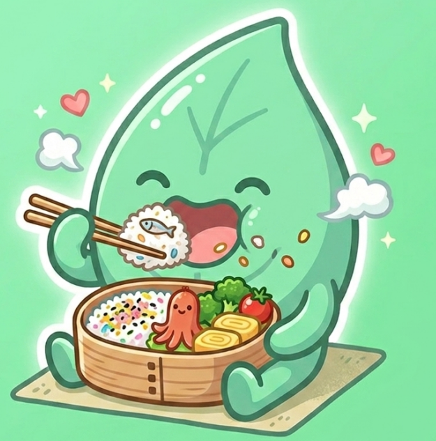
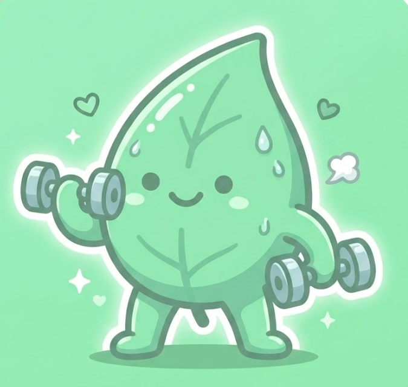

# 旧版品牌与视觉资产清单

> 基线 commit：`06b52f024547e76e1cd216e27f3ac41717dd3671`
> 提取日期：2026-07-16
> 状态：资产字节已复制并校验；版权来源待项目所有者确认

## 1. 保留结论

旧仓库共有 3 张叶子卡通角色 PNG 和 1 个 SVG 标识。四个文件均已复制到 `assets/brand/`，不再依赖未来会删除的 Taro `src/` 目录。复制前后逐字节 `cmp` 和 SHA-256 均一致。

### 角色预览

| 日常/首页 | 饮食 | 运动 |
|---|---|---|
|  |  |  |

## 2. 文件级清单

| 新文件 | 原始文件 | 尺寸 | 格式 | 大小 | SHA-256 | 旧版引用 | 决策 |
|---|---|---:|---|---:|---|---|---|
| `assets/brand/journey-leaf-home.png` | `src/assets/home.png` | 635×638 | RGBA PNG | 508,548 B | `12ea1b98f23de8a115ab07d139151d2a4de1f60dfa31a8daf0607ffdb0eadff1` | 首页“今日贴纸” | 保留，未来作为 Agent/状态角色 |
| `assets/brand/journey-leaf-food.png` | `src/assets/eat1.png` | 625×633 | RGBA PNG | 591,639 B | `0308eb72a1b1c5d3078f6d7b626681084abf63a61738606cf84c50a259bedabf` | 首页“吃了什么”入口 | 保留，未来作为饮食意图/确认状态 |
| `assets/brand/journey-leaf-activity.png` | `src/assets/sport1.png` | 675×640 | RGBA PNG | 344,512 B | `8966cdb73a8e8516c2276245b8b115d5cbd9f80701d292308e5a7892c77a3b94` | 首页“做了什么”入口 | 保留，未来作为运动意图/确认状态 |
| `assets/brand/journey-sticker-logo.svg` | `src/assets/sticker-logo.svg` | 96×96 | SVG | 1,338 B | `61047f5ead2f1b370e24c9d2970902178a0e8373afff5d343a17b6d183f18679` | 旧源码未导出/未使用 | 保留候选；阶段 3 决定 Logo 用法 |

`src/assets/index.js` 只是 Taro 导出文件，不属于视觉资产，不保留。

## 3. Git 与来源状态

- 四个文件均被 Git 跟踪，可从基线 commit 恢复。
- Git 历史显示四个文件在当前可见仓库历史的同一基线 commit 中出现，提交日期为 2026-04-13。
- 仓库内没有作者说明、设计源文件、许可证或第三方素材凭证。
- 因此当前只能标记为“项目仓库已有资产，来源待确认”，不能推断为已获得任何商业授权。

公开发布前必须由项目所有者确认以下一项并记录：

- [ ] 项目所有者原创。
- [ ] 已取得允许项目发布和修改的授权，并保存凭证。
- [ ] 仅用于私下面试演示，不公开分发。
- [ ] 来源无法确认，发布前替换。

## 4. 视觉观察

- 核心角色是一片拟人化绿色叶子，圆润、轻松、非医疗化。
- 三个状态通过动作和道具区分：行走、吃便当、举哑铃。
- 主色与旧主题的 mint 色系一致。
- PNG 含透明通道，但图像边缘和背景存在大面积浅绿色光晕；阶段 3 需要在实际卡片背景上验证边缘效果。
- 当前最大边长约 675 px，足够模拟器卡片展示；高密度全屏或商店宣传图可能需要重新制作高清源文件。

## 5. 后续使用建议

- 首页：日常叶子作为 Agent 入口附近的轻量人格提示，不遮挡热量数据。
- Agent 识别为饮食/运动：分别切换饮食或运动状态图。
- 确认卡片：只使用小尺寸角色或图标，不让插画占据主要操作区域。
- 空状态/降级：可以使用日常叶子，但文案必须明确 Agent 是否在线。
- 不从三张 PNG 反推或生成新的角色设定，除非用户后续明确授权重新设计。

## 6. 验证记录

- [x] 列出全部 `src/assets/` 文件。
- [x] 记录尺寸、格式、字节大小和 SHA-256。
- [x] 搜索实际源码引用。
- [x] 复制到与旧端解耦的稳定目录。
- [x] 使用 `cmp` 验证复制前后字节一致。
- [ ] 项目所有者确认版权/来源状态。
